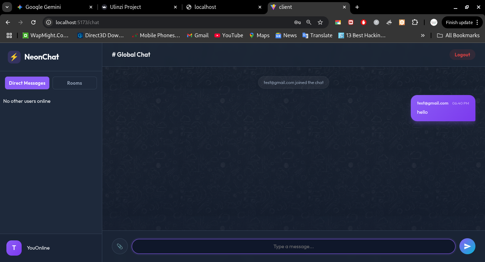
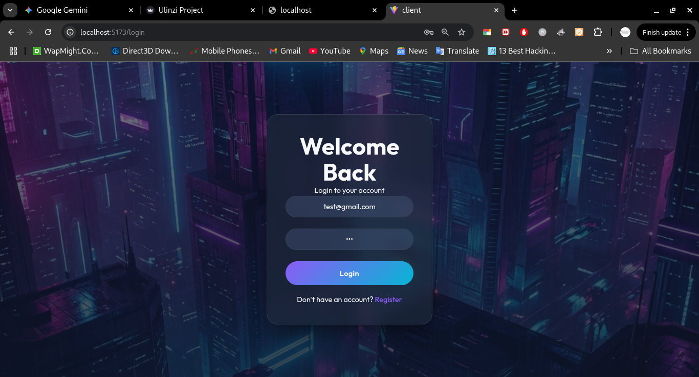
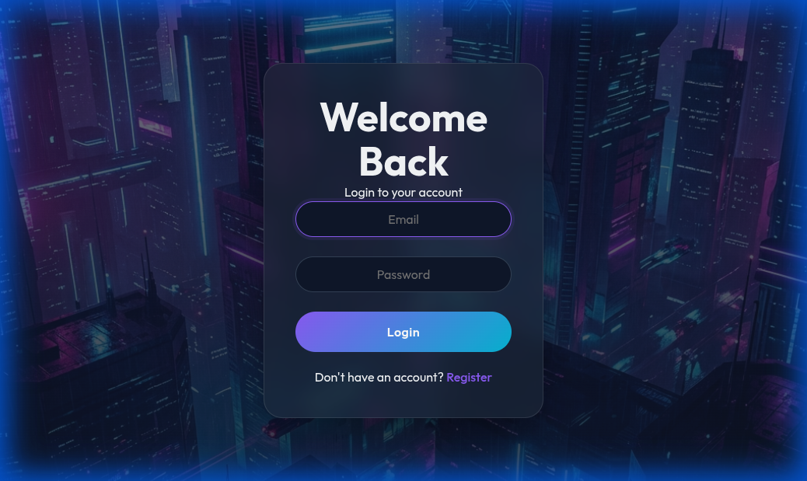

# Real-Time Chat Application (MERN Stack + Socket.io)

A full-featured real-time chat application built with the MERN stack (MongoDB, Express, React, Node.js) and Socket.io. This application supports real-time messaging, multiple rooms, private messaging, image sharing, and a modern, responsive UI with dark mode.



## Features

### Core Functionality
- **Real-time Messaging**: Instant message delivery using Socket.io.
- **User Authentication**: Secure Login and Registration using JWT (JSON Web Tokens).
- **Global Chat**: A default room for all connected users.
- **Online Status**: See who is currently online.
- **Typing Indicators**: Real-time feedback when users are typing.

### Advanced Features
- **Private Messaging**: Send direct messages to specific users.
- **Multiple Chat Rooms**: Create and join custom chat rooms.
- **Image Sharing**: Send and receive images in chat.
- **System Notifications**: Alerts for users joining/leaving and new messages.
- **Unread Message Counts**: Badges showing unread messages for private chats.
- **Modern UI/UX**: 
    - Futuristic dark theme with glassmorphism effects.
    - Custom backgrounds (Futuristic City for Login, WhatsApp-style Dark Pattern for Chat).
    - Responsive design for mobile and desktop.
    - Rounded, pill-shaped input fields for a modern look.

## Tech Stack

- **Frontend**: React, Vite, CSS3 (Custom Styling)
- **Backend**: Node.js, Express.js
- **Database**: MongoDB (Mongoose)
- **Real-time Communication**: Socket.io (Client & Server)
- **Authentication**: JSON Web Tokens (JWT), bcryptjs

## Prerequisites

- Node.js (v14+ recommended)
- MongoDB (Local instance or Atlas URI)

## Installation & Setup

### 1. Clone the Repository
```bash
git clone <repository-url>
cd real-time-communication-with-socket-io-Akubrecah
```

### 2. Backend Setup
Navigate to the server directory and install dependencies:
```bash
cd server
npm install
```

Create a `.env` file in the `server` directory:
```env
PORT=5000
CLIENT_URL=http://localhost:5173
MONGO_URI=mongodb://localhost:27018/chat-app  # Adjust port/URI as needed
JWT_SECRET=your_super_secret_key_here
```

Start the server:
```bash
npm run dev
```

### 3. Frontend Setup
Open a new terminal, navigate to the client directory, and install dependencies:
```bash
cd client
npm install
```

Start the React development server:
```bash
npm run dev
```

Access the application at `http://localhost:5173`.

## Usage Guide

1.  **Register**: Create a new account on the registration page.
2.  **Login**: Log in with your credentials.
3.  **Global Chat**: You will land in the `# Global Chat`. Messages sent here are visible to everyone.
4.  **Create Room**: Use the "+" button in the sidebar to create a new room.
5.  **Join Room**: Click on any room in the sidebar to join it.
6.  **Private Chat**: Click on a user in the "Users" list to start a private conversation.
7.  **Send Image**: Click the paperclip icon to attach and send an image.

## Screenshots

### Login Page


### Register Page


### Chat Interface


## Project Structure

```
├── client/                 # React Frontend
│   ├── public/            # Static assets (backgrounds)
│   ├── src/
│   │   ├── components/    # React Components (ChatRoom, Login, etc.)
│   │   ├── socket/        # Socket.io client configuration
│   │   ├── App.jsx        # Main App Component & Routing
│   │   └── App.css        # Global Styles
│   └── ...
├── server/                 # Node.js Backend
│   ├── models/            # Mongoose Models (User)
│   ├── routes/            # Express Routes (Auth)
│   ├── server.js          # Main Server Entry Point (Socket.io logic)
│   └── ...
└── README.md              # Project Documentation
```